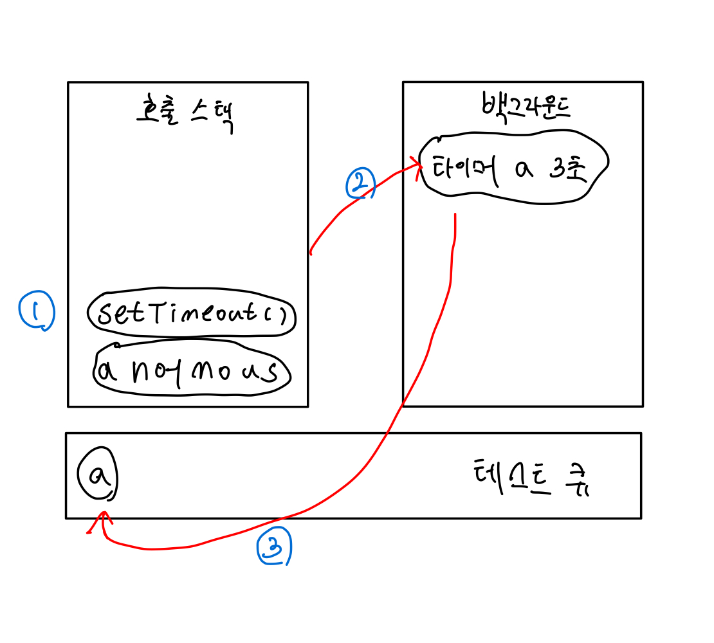

# Node.js Day03
<hr style = "background-color: black;">

## Event Loop
**Event Loop** 는 이벤트 발생 시 호출할 콜백 함수를 관리, 순서 지정을 하는 역할이다. 이는 노드가 종료될 때까지 이벤트 처리를 위한 작업을 반복하므로 **Loop** 라 한다.

## Background
_setTimeout_ 과 같은 타이머나 이벤트 리스너들이 대기하는 곳이다. JavaScript 가 아닌 다른 언어로 작성된 프로그램이라고 봐도 무방하다.
여러 작업이 동시에 실행될 수도 있다. 

## Test Queue
**Test Queue** 는 이벤트 발생 후, 백그라운드에서는 Test Queue 로 타이머나 이벤트 리스너의 콜백 함수를 보낸다. 정해진 순서대로 콜백들이 줄을 서 있으므로 **callBack Queue** 라고도 한다. 콜백들은 보통 완료된 순서대로 줄을 서 있지만 특정한 경우 순서가 바뀌기도 한다. 
<br>

```js
function a(){
    console.log("Run after 3 secs");
}
console.log("start");
setTimeout(run,3000);
console.log("end");
```
위 코드의 실행 과정은 이러하다.
<br />
> **1.** 전역 컨텍스트인 anoymous 와 setTimeout 이 호출 스택에 쌓인다.
> 
> **2.** 실행은 호출의 반대 순으로 실행되므로 setTimeout 이 먼저 실행된다.
> setTimeout 실행 시 콜백 a 는 백그라운드로 보낸다.
> 
> **3.** anonymous 가 호출 스택에서 빠지고, 백그라운드에서 3초를 센 뒤 a 함수를 테스트 큐로 보낸다. (3초를 세었다는 것은 백그라운드에 맡기 작업이 끝난거라 이해해도 무방함.)
>