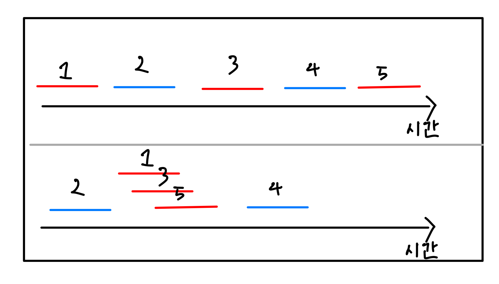

# Node.js Day04

## 논 블로킹 I/O
**논 블로킹**이란 이전 작업이 완료될 때까지 대기하지 않고 다음 작업을 수행한다는 것을 말한다.
반대로 이전 작업이 끝나고 다음 작업을 수행하는 것은 **블로킹**이라 한다.
파일 시스템 접근이나 네트워크를 통한 요청 같은 작업을 할 때 노드는 논 블로킹 방식을 사용한다.

논 블로킹 방식이 블로킹 방식 보다 좋은 점은 같은 작업들을 동시에 처리하기 때문에 아무래도 더 짧은 시간에 작업을 처리할 수 있다. 노드는 I/O 작업을 백그라운드에 넘겨 동시에 처리한다. 그렇기 때문에 동시애ㅔ 처리될 수 있는 작업들은 최대한 묶어서 백그라운드로 넘기는 논 블로킹 방식을 사용하기에 시간을 절약할 수 있다.
예를 들어보자.

다음 그림에서 빨강색 선은 동시처리가 가능한 작업이고 파랑색 선이 동시처리가 불가능한 작업이고, 모든 선들은 하나 당 1초의 수행시간을 가진다고 해보자. 첫 번째 케이스는 동시처리 가능한 작업들도 순차적으로 코딩하여 5초의 수행시간을 가진다. 하지만 두번째 케이스는 동시처리가 가능한 작업들을 함께 묵어서 코딩하였기에 수행시간이 3초(±α초)로 시간을 단축할 수 있다.
이러한 이유 때문에 동시에 처리할 수 있는 작업을 논 블로킹 방식으로 코딩하지 않으면 손실이 생기므로 논 블로킹으로 코딩하는 습관을 들이면 코드의 실행과정을 더 최적화 시킬 수 있을것이다.